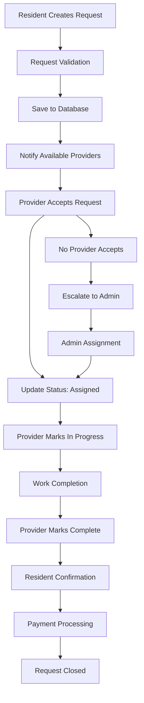
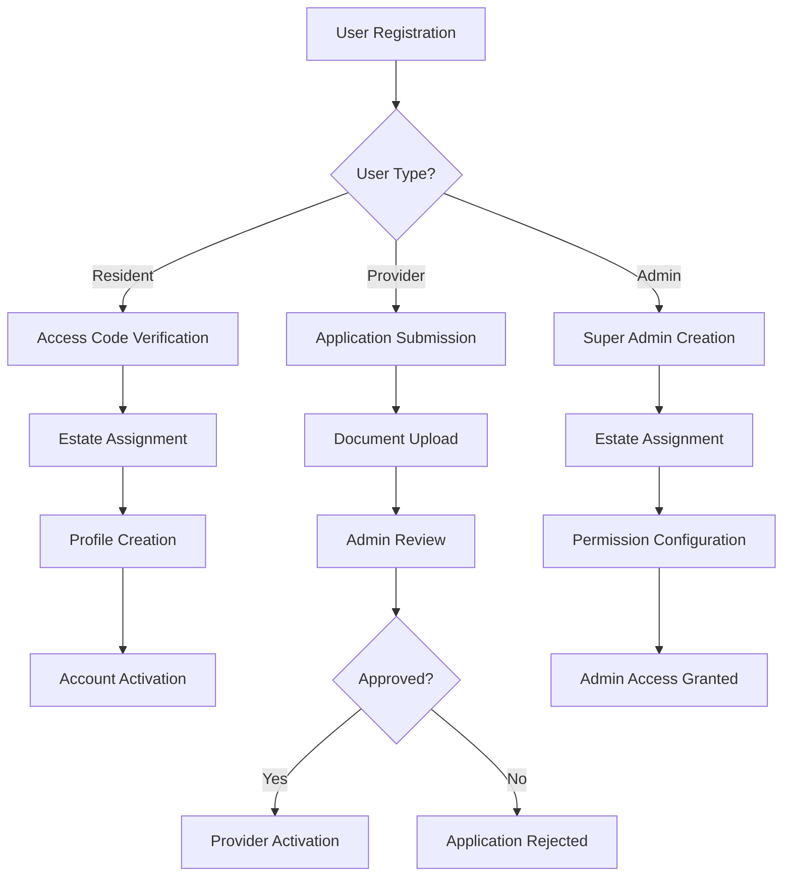
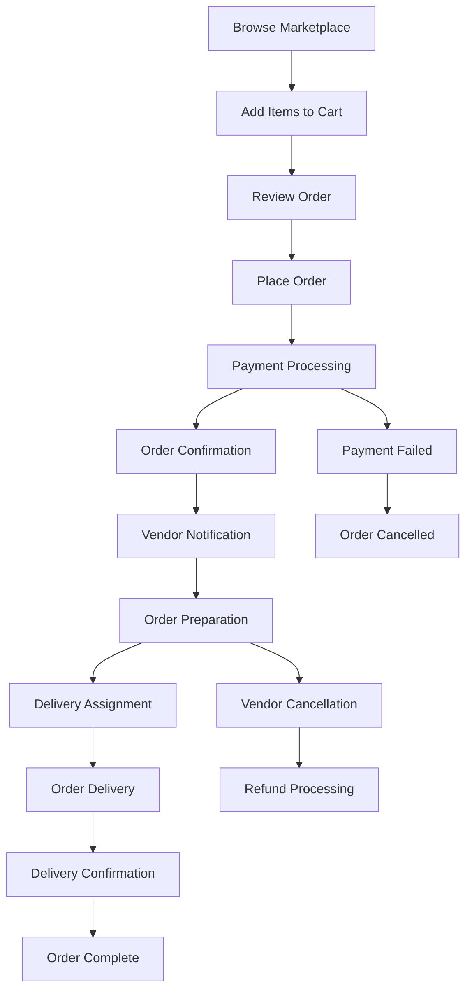
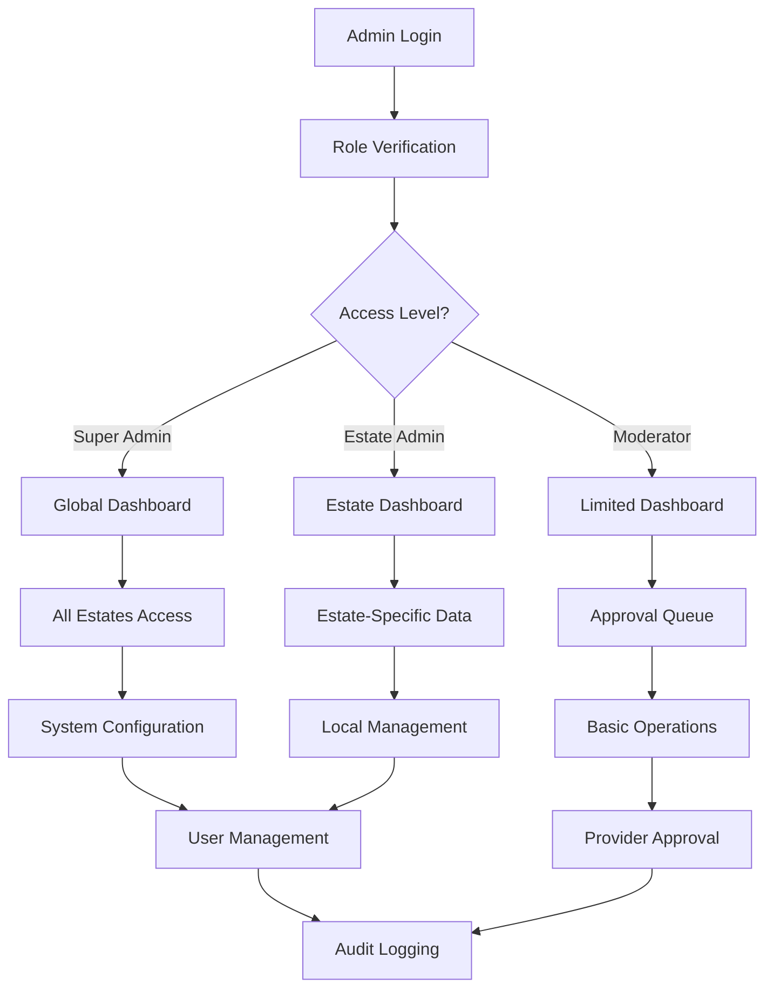

# CityConnect Architecture Document

**Project:** CityConnect - Multi-Tenant Estate Service Platform  
**Version:** 1.0  
**Date:** September 2025  
**Document Type:** System & Solution Architecture

---

## Table of Contents

1. [Executive Summary](#executive-summary)
2. [System Architecture](#system-architecture)
3. [Solution Architecture](#solution-architecture)
4. [Process Flows](#process-flows)
5. [Data Architecture](#data-architecture)
6. [Security Architecture](#security-architecture)
7. [Integration Architecture](#integration-architecture)
8. [Deployment Architecture](#deployment-architecture)

---

## Executive Summary

CityConnect is a comprehensive full-stack MVP web application that connects estate residents with service providers (artisans and market runners). The platform features a sophisticated multi-tenant admin dashboard alongside a resident-facing service request system, supporting role-based access control, real-time service management, and integrated marketplace functionality.

### Key Features
- **Multi-tenant Admin System**: Comprehensive management dashboard with estate-specific access controls
- **Dual Authentication**: Separate admin and resident authentication systems
- **Service Request Management**: End-to-end workflow from request to completion
- **Marketplace Integration**: Product catalog and ordering system
- **Real-time Updates**: Live status tracking and notifications
- **Geographic Services**: Mapbox integration for location-based features

---

## System Architecture

### High-Level Architecture

```
┌─────────────────────────────────────────────────────────────────┐
│                        PRESENTATION LAYER                        │
├─────────────────────────────────────────────────────────────────┤
│  Admin Dashboard (React)    │    Resident Interface (React)     │
│  - Estate Management        │    - Service Requests             │
│  - User Management          │    - Marketplace                  │
│  - Provider Management      │    - Order Tracking               │
│  - Analytics & Reports      │    - Profile Management           │
└─────────────────────────────────────────────────────────────────┘
                                    │
┌─────────────────────────────────────────────────────────────────┐
│                       APPLICATION LAYER                         │
├─────────────────────────────────────────────────────────────────┤
│              Express.js API Gateway & Business Logic            │
│  - Authentication & Authorization                               │
│  - Request Routing & Validation                                 │
│  - Business Rule Enforcement                                    │
│  - Session Management                                           │
└─────────────────────────────────────────────────────────────────┘
                                    │
┌─────────────────────────────────────────────────────────────────┐
│                         DATA LAYER                              │
├─────────────────────────────────────────────────────────────────┤
│   MongoDB (Admin)          │      PostgreSQL (Resident)        │
│   - Estates & Users        │      - Service Requests           │
│   - Providers & Categories │      - Resident Profiles          │
│   - Marketplace Items      │      - Session Storage            │
│   - Audit Logs            │      - Transaction Records        │
└─────────────────────────────────────────────────────────────────┘
                                    │
┌─────────────────────────────────────────────────────────────────┐
│                    EXTERNAL SERVICES                            │
├─────────────────────────────────────────────────────────────────┤
│              Mapbox API        │        Neon Database           │
│              - Geolocation     │        - PostgreSQL Hosting   │
│              - Map Services    │        - Connection Pooling   │
└─────────────────────────────────────────────────────────────────┘
```

### Technology Stack

#### Frontend Stack
- **Framework**: React 18 with TypeScript
- **Build System**: Vite for development and production builds
- **Styling**: TailwindCSS + ShadCN UI Components
- **State Management**: TanStack React Query for server state
- **Routing**: Wouter for lightweight client-side routing
- **Form Management**: React Hook Form with Zod validation
- **Animation**: Framer Motion for UI transitions

#### Backend Stack
- **Runtime**: Node.js with Express.js framework
- **Language**: TypeScript for type safety
- **Authentication**: Passport.js with local strategy
- **Session Management**: Express-session with PostgreSQL store
- **Validation**: Zod schemas for request validation
- **Password Security**: BCrypt for password hashing

#### Database Architecture
- **Admin System**: MongoDB with Mongoose ODM
- **Resident System**: PostgreSQL with Drizzle ORM
- **Session Storage**: PostgreSQL with connect-pg-simple
- **Connection Management**: Connection pooling and monitoring

#### Infrastructure & Hosting
- **Platform**: Replit for development and hosting
- **Database Hosting**: Neon for PostgreSQL, MongoDB Atlas
- **CDN & Assets**: Integrated asset management
- **Environment**: Development and production configurations

---

## Solution Architecture

### Multi-Tenant Architecture Pattern

The system implements a **Strangler Fig** pattern, gradually migrating from a simpler resident system to a comprehensive admin-managed multi-tenant platform.

```
┌─────────────────────────────────────────────────────────────┐
│                    TENANT ISOLATION                         │
├─────────────────────────────────────────────────────────────┤
│  Estate A          │  Estate B          │  Estate C        │
│  ┌──────────────┐   │  ┌──────────────┐   │  ┌────────────┐ │
│  │ Residents    │   │  │ Residents    │   │  │ Residents  │ │
│  │ Providers    │   │  │ Providers    │   │  │ Providers  │ │
│  │ Services     │   │  │ Services     │   │  │ Services   │ │
│  │ Marketplace  │   │  │ Marketplace  │   │  │ Marketplace│ │
│  └──────────────┘   │  └──────────────┘   │  └────────────┘ │
└─────────────────────────────────────────────────────────────┘
                              │
┌─────────────────────────────────────────────────────────────┐
│                 SHARED ADMIN LAYER                          │
├─────────────────────────────────────────────────────────────┤
│  Super Admin    │  Estate Admin    │  Moderators           │
│  - All Estates  │  - Single Estate │  - Limited Access     │
│  - Global Mgmt  │  - Local Mgmt    │  - View & Approve     │
└─────────────────────────────────────────────────────────────┘
```

### Role-Based Access Control (RBAC)

```
SUPER_ADMIN
├── Global Estate Management
├── User & Provider Creation
├── System Configuration
└── Cross-Tenant Analytics

ESTATE_ADMIN  
├── Estate-Specific Management
├── Resident & Provider Approval
├── Local Service Configuration
└── Estate Analytics

MODERATOR
├── View Estate Data
├── Approve Service Requests
├── Basic User Management
└── Limited Reporting

RESIDENT
├── Service Request Creation
├── Marketplace Access
├── Order Management
└── Profile Management

PROVIDER
├── Service Request Acceptance
├── Job Management
├── Profile & Skills Update
└── Earnings Tracking
```

### Data Flow Architecture

```
┌─────────────────┐    ┌──────────────┐    ┌─────────────────┐
│   Admin User    │────│   Admin API  │────│   MongoDB       │
│   Interface     │    │   Gateway    │    │   Collections   │
└─────────────────┘    └──────────────┘    └─────────────────┘
                              │
┌─────────────────┐    ┌──────────────┐    ┌─────────────────┐
│  Resident UI    │────│ Resident API │────│   PostgreSQL    │
│   Interface     │    │   Endpoints  │    │   Tables        │
└─────────────────┘    └──────────────┘    └─────────────────┘
                              │
┌─────────────────┐    ┌──────────────┐
│  External APIs  │────│  Integration │
│  (Mapbox, etc.) │    │   Services   │
└─────────────────┘    └──────────────┘
```

---

## Process Flows

### 1. Service Request Lifecycle



### 2. User Onboarding Process



### 3. Marketplace Order Flow



### 4. Admin Management Workflow



---

## Data Architecture

### MongoDB Collections (Admin System)

#### Users Collection
```javascript
{
  _id: ObjectId,
  name: String,
  email: String (unique),
  phone: String,
  passwordHash: String,
  globalRole: Enum['super_admin', 'estate_admin', 'moderator', 'resident', 'provider'],
  isActive: Boolean,
  lastLogin: Date,
  createdAt: Date,
  updatedAt: Date
}
```

#### Estates Collection
```javascript
{
  _id: ObjectId,
  name: String,
  slug: String (unique),
  address: String,
  description: String,
  coverage: GeoJSON.Polygon,
  settings: {
    servicesEnabled: [String],
    marketplaceEnabled: Boolean,
    paymentMethods: [String],
    deliveryRules: Object
  },
  createdAt: Date,
  updatedAt: Date
}
```

#### Providers Collection
```javascript
{
  _id: ObjectId,
  userId: String,
  estates: [String],
  categories: [Enum],
  experience: Number,
  rating: Number,
  totalJobs: Number,
  isApproved: Boolean,
  documents: [String],
  location: GeoJSON.Point,
  createdAt: Date,
  updatedAt: Date
}
```

### PostgreSQL Tables (Resident System)

#### users Table
```sql
CREATE TABLE users (
  id VARCHAR PRIMARY KEY DEFAULT gen_random_uuid(),
  name VARCHAR NOT NULL,
  email VARCHAR UNIQUE NOT NULL,
  phone VARCHAR,
  access_code VARCHAR(6),
  role VARCHAR DEFAULT 'resident',
  created_at TIMESTAMP DEFAULT NOW(),
  updated_at TIMESTAMP DEFAULT NOW()
);
```

#### service_requests Table
```sql
CREATE TABLE service_requests (
  id VARCHAR PRIMARY KEY DEFAULT gen_random_uuid(),
  user_id VARCHAR REFERENCES users(id),
  category VARCHAR NOT NULL,
  description TEXT NOT NULL,
  urgency VARCHAR DEFAULT 'medium',
  status VARCHAR DEFAULT 'pending',
  address TEXT,
  scheduled_time TIMESTAMP,
  created_at TIMESTAMP DEFAULT NOW(),
  updated_at TIMESTAMP DEFAULT NOW()
);
```

### Data Relationships

```
Users ────┬──── Memberships ────── Estates
          │
          ├──── Service Requests
          │
          ├──── Providers ──────── Categories
          │
          └──── Orders ─────────── Marketplace Items
```

---

## Security Architecture

### Authentication Strategy

1. **Dual Authentication Systems**
   - Admin: Email/password with session-based auth
   - Resident: Access code or email/password

2. **Session Management**
   - Server-side session storage in PostgreSQL
   - Secure HTTP-only cookies
   - Session timeout and renewal

3. **Password Security**
   - BCrypt hashing with salt rounds
   - Password complexity requirements
   - Secure password reset flow

### Authorization Framework

```
Request → Authentication Check → Role Verification → Resource Access Control
```

1. **Route Protection**
   - Middleware-based authentication
   - Role-based route access
   - Estate context enforcement

2. **Data Access Control**
   - Tenant isolation at database level
   - Query filtering by estate context
   - Cross-tenant data prevention

3. **API Security**
   - Request validation with Zod schemas
   - Rate limiting for auth endpoints
   - SQL injection prevention

### Audit & Compliance

```javascript
// Audit Log Structure
{
  _id: ObjectId,
  adminUserId: String,
  estate: String,
  action: Enum['CREATE', 'UPDATE', 'DELETE', 'APPROVE'],
  resourceType: Enum['USER', 'PROVIDER', 'ESTATE', 'REQUEST'],
  resourceId: String,
  changes: Object,
  ipAddress: String,
  userAgent: String,
  timestamp: Date
}
```

---

## Integration Architecture

### External Service Integration

#### Mapbox Integration
- **Purpose**: Location services and mapping
- **Implementation**: Client-side SDK integration
- **Features**: Geocoding, reverse geocoding, map display
- **Security**: API key management through environment variables

#### Neon Database Integration
- **Purpose**: Managed PostgreSQL hosting
- **Connection**: Connection pooling and SSL encryption
- **Features**: Automatic backups, scaling, monitoring
- **Failover**: Connection retry logic and error handling

### Internal API Architecture

```
Frontend ──── HTTP/HTTPS ──── Express Router ──── Controller Layer ──── Service Layer ──── Database
    │                              │                      │                   │              │
    ├─ React Query Cache          ├─ Middleware Stack    ├─ Validation       ├─ Business    ├─ MongoDB
    ├─ State Management           ├─ Authentication      ├─ Error Handling   │  Logic       ├─ PostgreSQL
    └─ UI Components              └─ Rate Limiting       └─ Response Format  └─ Data Access └─ Session Store
```

### API Design Patterns

1. **RESTful Endpoints**
   - Resource-based URLs
   - HTTP method semantics
   - Standard status codes

2. **Request/Response Format**
   - JSON payload validation
   - Consistent error responses
   - Pagination support

3. **Error Handling**
   - Global error middleware
   - Structured error responses
   - Client-friendly messages

---

## Deployment Architecture

### Development Environment
```
Replit Development Environment
├── Hot Reload Development Server
├── Environment Variable Management
├── Database Connections (Dev)
└── Debug & Logging Tools
```

### Production Considerations
```
Production Deployment
├── Express.js Application Server
├── Static Asset Serving
├── Database Connection Pooling
├── Environment Configuration
├── Health Check Endpoints
└── Error Monitoring
```

### Scalability Architecture

1. **Horizontal Scaling**
   - Stateless application design
   - Database connection pooling
   - Session store externalization

2. **Performance Optimization**
   - React Query caching
   - Database query optimization
   - Asset optimization

3. **Monitoring & Observability**
   - Application logging
   - Performance metrics
   - Error tracking
   - Audit trail maintenance

---

## Technical Debt & Future Improvements

### Current Technical Debt
1. **Database Architecture**: Dual database system adds complexity
2. **Authentication**: Two separate auth systems to maintain
3. **Session Management**: PostgreSQL-based sessions may not scale
4. **Error Handling**: Inconsistent error reporting across modules

### Recommended Improvements
1. **Unified Authentication**: Consolidate auth systems
2. **Database Normalization**: Consider unified database approach
3. **Microservices**: Split large admin system into smaller services
4. **Real-time Features**: Add WebSocket support for live updates
5. **API Documentation**: OpenAPI/Swagger documentation
6. **Testing Coverage**: Comprehensive test suite implementation

---

## Conclusion

CityConnect represents a comprehensive multi-tenant service platform with sophisticated admin management capabilities. The architecture supports current requirements while providing flexibility for future enhancements. The dual-database approach enables gradual migration and feature expansion while maintaining data integrity and performance.

The system's modular design, comprehensive security measures, and scalable architecture make it suitable for managing multiple estates with thousands of residents and service providers.

---

**Document Prepared By**: AI Development Assistant  
**Last Updated**: September 2025  
**Status**: Production Ready  
**Next Review**: Q1 2026